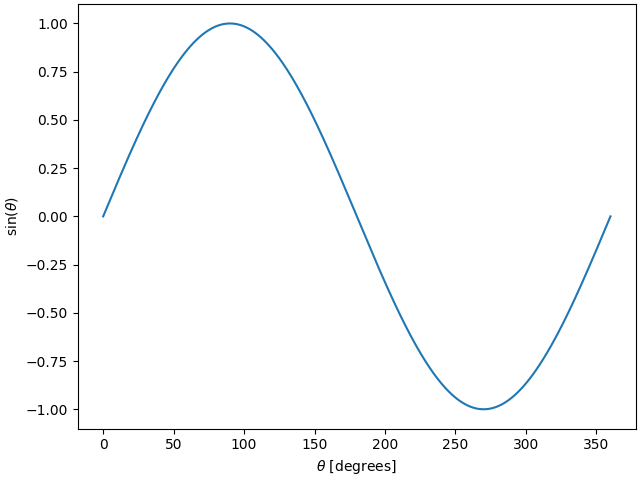
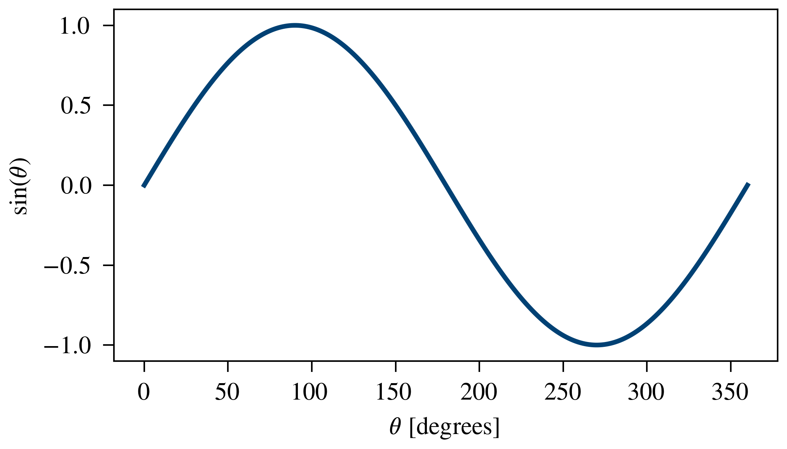
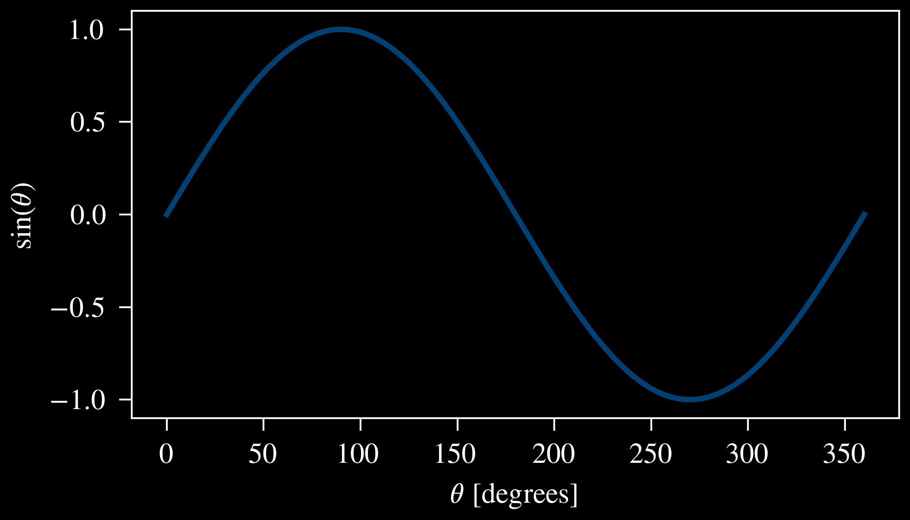

# `funkyfresh`: Science Journal Graphics Styles for Matplotlib

This package provides functions which automatically set Matplotlib style 
parameters (fonts, line weights, etc.) to match those of select scientific 
journals. If you use this, your plots will look funky and fresh (at least 
compared to the Matplotlib defaults).

## Currently-Supported Styles
- American Geophysical Union (AGU)
  - Journal of Geophyiscal Research (JGR)
  - Geophysical Research Letters (GRL)
- American Astronomical Society (AAS)
  - Astrophysical Journal Letters (ApJL)
  - Astronomical Journal (AJ)
  - Astrophysical Journal (ApJ)
  - Planetary Science Journal (PSJ)
- Caltech Thesis/Dissertation:
  - Includes colors from the Caltech Identity Toolkit (https://identity.caltech.edu)

## Installation
Here are some installation instructions for the average Anaconda user, if 
you're more advanced I'm sure you can figure it out from here. (Note: in the
instructions below I will assume that you are using a virtual environment named 
`myenv`.) I've tested this using Python 3.10.
1. Activate your virtual environment:<br>
    `% conda activate myenv`
2. Install the `funkyfresh` package and its dependencies:<br>
    `% python -m pip install git+https://github.com/zachariahmilby/science-journal-graphics-styles.git`

You're now ready to use the `funkyfresh` package!

## Usage
Usage is pretty simple. To start, import the `FunkyFresh` class and instantiate
it. It has one optional keyword argument: set `highres_inline_plots=True` if 
you want high-resolution inline plots in Jupyter notebooks. The default is 
`False`. For example, to use FunkyFresh with high-resolution inline plots:
```
>>> from funkyfresh import FunkyFresh
>>> ffs = FunkyFresh(highres_inline_plots=True)
```

You have two options for setting runtime parameters. You're probably here 
because you want to set one of the journal styles. To do this, you simply need
the method `set_named_style()`. For example, to set your style to match an AGU
journal:
```
>>> ffs.set_named_style('AGU')
```

This will set the Matplotlib runtime parameters to match those of the AGU 
journals (appropriate line weights, Times New Roman font, etc.) If you want to 
know all of the currently-available styles, you can access them get them 
through the method `get_available_styles()`:
```
>>> ffs.get_available_styles()
['AAS', 'AGU', 'Caltech Thesis']
```

Another option is just to set a custom style from a dictionary of runtime 
parameters. There are many different examples of how to do this online (for 
instance, you might use `matplotlib.rcParams`, or you might use `plt.rc`, or
something else). I've tried to make it simple to implement here. You simply 
pass a dictionary containing the parameter and the new value. Check the 
Matplotlib [rcParams documentation](https://matplotlib.org/stable/tutorials/introductory/customizing.html) 
for options. For example, to change only the font size to 24 pt:
```
style = {'font.size': 24}
ffs.set_custom_style(rcparams=style)
```

Once you've set a style, you can access two style properties through the `ffs` 
object. The `colors` property has a dictionary of colors appropriate to the 
style you're using. By default it includes some standard RGB and CMYK colors, 
in addition to any custom colors. For the AGU style, it includes the custom AGU 
blue color found throughout their journals. 
```
>>> ffs.colors
{'red': '#D62728', 'orange': '#FF7F0E', ... , 'agu_blue': '#004174'}
```
The `figure_widths` property has a set of figure width measurements appropriate 
to the journal(s) you've selected. For example, with the AGU style, you could 
have a column-width figure, a text-width figure or a page-width figure.
```
ffs.figure_widths

>>> {'column_width': 3.5, 'text_width': 5.6, 'page_width': 7.5}
```
All of these are available in the `ffs` object after you set the style.

### Context Manager
There is also a context manager available if you want to temporarily change to 
a named style:
```
with ffs.named_style_context(named_style='AGU'):
    plt.plot(...)
```

### LaTeX Rendering
For both `set_named_style` and `set_custom_style` you have the option to have 
the option to use LaTeX to render the text. This requires a local LaTeX 
installation, but allows for better control over the final look of the text in
your figures.

#### Named Style
For a named style, set `use_latex` to `True` when setting:
```
ffs.set_named_style('AAS', use_latex=True) 
```

The default packages loaded are `siunitx`, `amsmath`, `amssymb`, `isomath`, 
`physics` and `mhchem` version 4. If you want a font other than the Computer
Modern default, you can set that package explicitly. You can also pass options
for the font package. For example, to use the excellent STIX2 font set with 
upright integrals (in LaTeX format `\usepackage[upint]{stix2}`):
```
ffs.set_named_style('AAS', use_latex=True, latex_font_package='stix2', 
                    latex_font_options='upint') 
```

You can also load any additional packages after this. You must explicitly pass
these as though you were loading them in a LaTeX document, but in one line. 
Because of the blackslashes, you'll want this to be a raw string (note the `r` 
before the opening single quote), As a terrible example, to load the `geometry` 
package with one-inch margins and the `hyperref` package: 
```
additional_latex_packages = r'\usepackage[margin=1in]{geometry}\usepackage{hyperref}'
```

#### Custom Style
The usage of the custom style is somewhat simpler, since it's entirely up to 
you. There are no default packages loaded. You simply set `use_latex=True` then
pass every package you want to use as a single-line raw string to 
`latex_preamble`. For example:
```
latex_preamble = r'\usepackage[upint]{stix2}\usepackage{amsmath, physics}'
ffs.set_custom_style(use_latex=True, latex_preamble=latex_preamble)
```

## Example
Let's say for some reason I want a plot of one period of a sine wave for a 
paper I'm going to publish in the AGU journal Geophysical Research Letters. 
Here's a sine curve plotted with the default settings. It looks alright, but 
the fonts don't match the journal style at all, so this plot will look 
inconsistent with the rest of the document.
```
import astropy.units as u
import matplotlib.pyplot as plt
import numpy as np

theta = np.linspace(0, 360, 3601) * u.degree

fig, axis = plt.subplots(layout='constrained')
axis.plot(theta, np.sin(theta))
axis.set_xlabel(r'$\theta$ [degrees]')
axis.set_ylabel(r'$\sin(\theta)$')
plt.show()
```


By setting the named `AGU` style and changing the figure width to 
column width and the color of the line to the AGU blue color, the same plot 
looks much better with minimal changes to the code. The fonts now match the 
journal figure captions both in typeface and size, the lineweights also match, 
and the figure size should (hopefully) encourage whoever is typesetting your 
paper to place this image in a column-width figure. I'd probably still make a 
few changes (like placing major ticks along the horizontal axis to multiples of 
60, and minor ticks to multiples of 15), but those types of changes aren't a 
matter of visual style but rather best practices for data display.
```
import astropy.units as u
import matplotlib.pyplot as plt
import numpy as np
from funkyfresh import FunkyFresh

ffs = FunkyFresh(highres_inline_plots=True)
ffs.set_named_style('AGU', use_latex=True)

theta = np.linspace(0, 360, 3601) * u.degree

fig, axis = plt.subplots(figsize=(ffs.figure_widths['column_width'], 2),
                         layout='constrained')
axis.plot(theta, np.sin(theta), color=ffs.colors['agu_blue'])
axis.set_xlabel(r'$\theta$ [degrees]')
axis.set_ylabel(r'$\sin(\theta)$')
plt.savefig('anc/funkyfresh.png')
```


You can also easily invert the colors by using the standard 
`plt.style.use('dark_background')`.
```
import astropy.units as u
import matplotlib.pyplot as plt
import numpy as np
from funkyfresh import FunkyFresh

ffs = FunkyFresh(highres_inline_plots=True)
ffs.set_named_style('AGU', use_latex=True)
plt.style.use('dark_background')

theta = np.linspace(0, 360, 3601) * u.degree

fig, axis = plt.subplots(figsize=(ffs.figure_widths['column_width'], 2),
                         layout='constrained')
axis.plot(theta, np.sin(theta), color=ffs.colors['agu_blue'])
axis.set_xlabel(r'$\theta$ [degrees]')
axis.set_ylabel(r'$\sin(\theta)$')
plt.savefig('anc/funkyfresh_dark.png')
```

