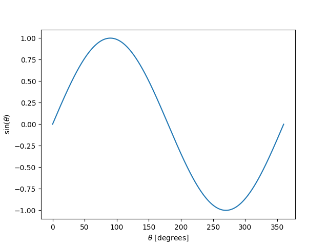
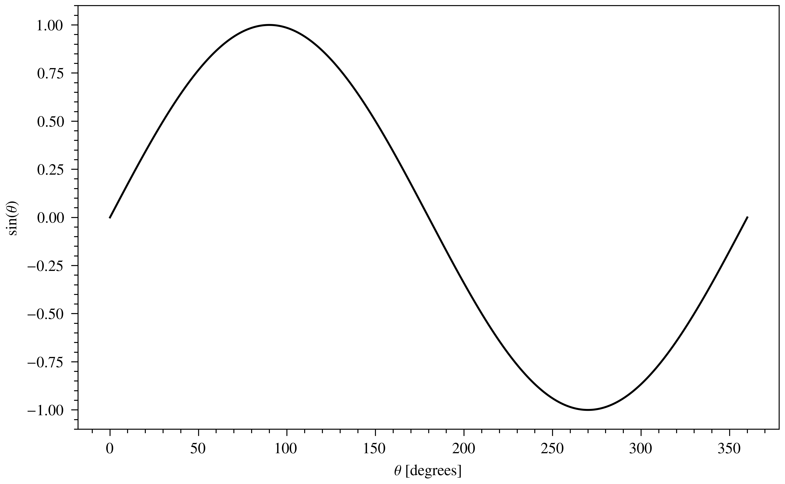
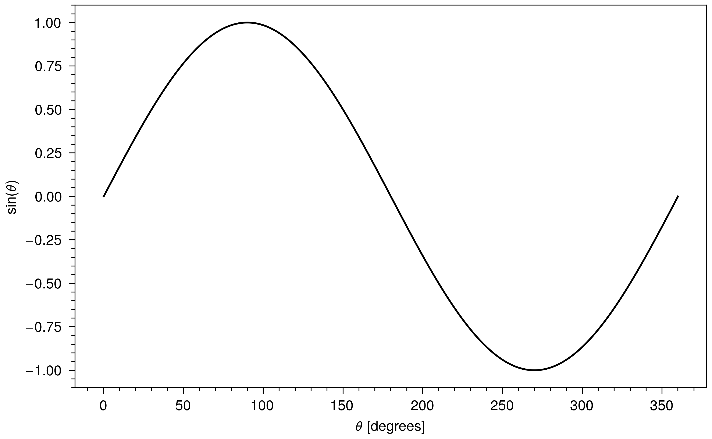
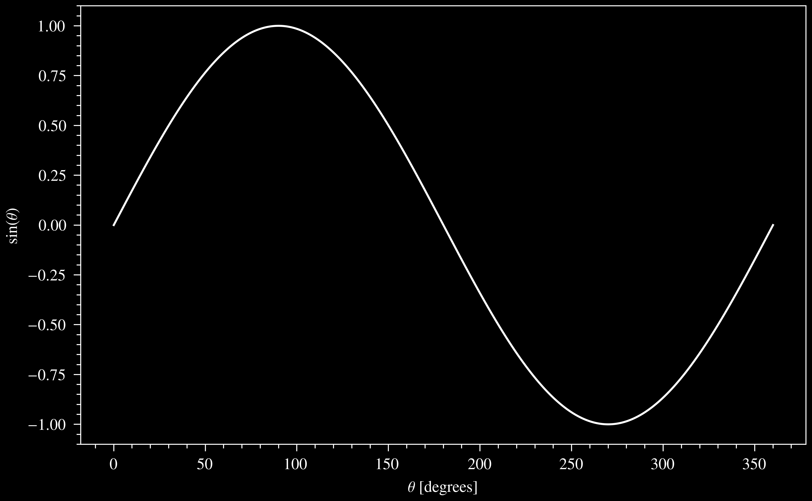

# `funkyfresh`: Planetary Science Journal Graphics Styles for Matplotlib

This package provides a convenient way to automatically set Matplotlib style 
parameters (fonts, line weights, etc.) to match those of select scientific 
journals commonly used by planetary scientists, along with the PhD thesis style
of my institution (Caltech). If you use this, your plots will look funky and 
fresh (at least compared to the Matplotlib defaults).

## Styles Currently Supported
- Astronomy & Astrophysics (A&A)
- American Astronomical Society (AAS)
  - Astrophysical Journal Letters (ApJL)
  - Astronomical Journal (AJ)
  - Astrophysical Journal (ApJ)
  - Planetary Science Journal (PSJ)
- American Geophysical Union (AGU)
  - Journal of Geophyiscal Research (JGR)
  - Geophysical Research Letters (GRL)
- Elsevier
  - Icarus
- Monthly Notices of the Royal Astronomical Society (MNRAS)
- Caltech PhD thesis/dissertation
- My personal whitepaper style (based on the LaTeX article default class)

## Installation
Here are some installation instructions for the average Anaconda user, if 
you're more advanced I'm sure you can figure it out from here. (Note: in the
instructions below I will assume that you are using a virtual environment named 
`myenv`.) I've tested this using Python 3.10.
1. Activate your virtual environment:<br>
    `% conda activate myenv`
2. Install the `funkyfresh` package and its dependencies:<br>
    `% python -m pip install git+https://github.com/zachariahmilby/funky-fresh.git`

You're now ready to use the `funkyfresh` package!

>**NOTE**<br>
> Look, you're not going to make nice looking plots without LaTeX. You're just 
> not. So, this package requires a local installation of TeX Live 
> (https://tug.org/texlive/), which you will have to do separately.

## Usage
Usage is pretty simple. To get the list of available journal styles, use 
`get_available_styles()`:
```
>>> from funkyfresh import get_available_styles
>>> get_available_styles()

['A&A', 'AAS', 'AGU', 'Elsevier', 'MNRAS', 'Caltech Thesis', 'Whitepaper']
```

To set one of these styles, use `set_style()`. For example, to set your style to match an AGU
journal:
```
>>> from funkyfresh import set_style
>>> set_style('AGU')

Loading FunkyFresh style...
   Name: American Geophysical Union
   Font: Times New Roman
   Font size: 8
   Line width: 0.5
   Figure widths:
      column: 3.5 in
      text: 5.6 in
      page: 7.5 in
   Default figure size: (5.6, 3.461)
   Custom color: agu_blue
```

This will set the Matplotlib runtime parameters to match those of the AGU 
journals (appropriate line weights, Times New Roman font, etc.). It will also 
print out some information about the style, which is useful if you want to know
what figure sizes you should choose from, the default line width and any custom
colors available. If you don't want this to print, you can set the keyword 
`silent=True`.

You can also import a variety of colors. A good set of default colors are 
available as a dictionary called `standard_colors`.
```
>>> from funkyfresh import standard_colors
>>> standard_colors

{'red': '#D62728', 'orange': '#FF7F0E', 'yellow': '#FDB813', 
 'green': '#2CA02C', 'blue': '#0079C1', 'violet': '#9467BD', 
 'cyan': '#17BECF', 'magenta': '#D64ECF', 'brown': '#8C564B', 
 'darkgrey': '#3F3F3F', 'grey': '#7F7F7F', 'lightgrey': '#BFBFBF', 
 'black': '#000000', 'white': '#FFFFFF'}
```
The custom colors listed for various styles can also be imported. For example,
if you want to use the `agu_blue` color in your plots, you can import it as a
variable containing the color as a hexadecimal string:
```
>>> from funkyfresh import agu_blue
>>> agu_blue

#004174
```
You can then set `plt.plot(..., color=agu_blue, ...)`.

### Sans-Serif Presentation Mode
For each style, you can also toggle `presentation=True` which will change the
fonts to Helvetica. See the example in the next section.

>**CAUTION**<br>
> Fonts are not necessarily comprehensive and not all symbols may be available! 
> For Greek characters, I've established the following syntax: upright versions
> using the addition of `up` before the name, e.g., `$\upgamma$` for an 
> upright γ or `$\upGamma$` an upright Γ. To make these (or their standard 
> italic versions) bold, use `\boldsymbol` before, e.g., `$\boldsymbol\Delta$`.

## Example
Let's say for some reason I want a plot of one period of a sine wave for a 
paper I'm going to publish in the AGU journal Geophysical Research Letters. 
Here's a sine curve plotted with the default settings. It looks alright, but 
the fonts don't match the journal style at all, so this plot will look 
inconsistent with the rest of the document.
```
import astropy.units as u
import matplotlib.pyplot as plt
import numpy as np

theta = np.linspace(0, 360, 3601) * u.degree

fig, axis = plt.subplots()
axis.plot(theta, np.sin(theta))
axis.set_xlabel(r'$\theta$ [degrees]')
axis.set_ylabel(r'$\sin(\theta)$')
plt.show()
```


The result changes significantly by simply setting the `AGU` style. The fonts 
now match the journal figure captions both in typeface and size, the 
line weights also match, and the figure size should (hopefully) encourage 
whoever is typesetting your paper to place this image in a column-width figure. 
I'd probably still make a few changes (like placing major ticks along the 
horizontal axis to multiples of 60, and minor ticks to multiples of 15), but 
those types of changes aren't a matter of visual style but rather best 
practices for data display.
```
import astropy.units as u
import matplotlib.pyplot as plt
import numpy as np

from funkyfresh import set_style

set_style(name='AGU', silent=True)

fig, axis = plt.subplots()
axis.plot(theta, np.sin(theta))
axis.set_xlabel(r'$\theta$ [degrees]')
axis.set_ylabel(r'$\sin(\theta)$')
plt.show()
```


If you want to make a version of this figure in sans-serif font for a 
PowerPoint presentation or similar, simply set the keyword `presentation=True`
and the fonts will be replaced with Helvetuca, which seems to be the most 
commonly used sans serif font (though it lacks significant math support, so be 
careful!)

```
import astropy.units as u
import matplotlib.pyplot as plt
import numpy as np

from funkyfresh import set_style

set_style(name='AGU', silent=True, presentation=True)

fig, axis = plt.subplots()
axis.plot(theta, np.sin(theta))
axis.set_xlabel(r'$\theta$ [degrees]')
axis.set_ylabel(r'$\sin(\theta)$')
plt.show()
```


You can also easily invert the colors by using the standard 
`plt.style.use('dark_background')` after setting the FunkyFresh style.
```
import astropy.units as u
import matplotlib.pyplot as plt
import numpy as np

from funkyfresh import set_style

set_style(name='AGU', silent=True)
plt.style.use('dark_background')

fig, axis = plt.subplots()
axis.plot(theta, np.sin(theta))
axis.set_xlabel(r'$\theta$ [degrees]')
axis.set_ylabel(r'$\sin(\theta)$')
plt.show()
```

